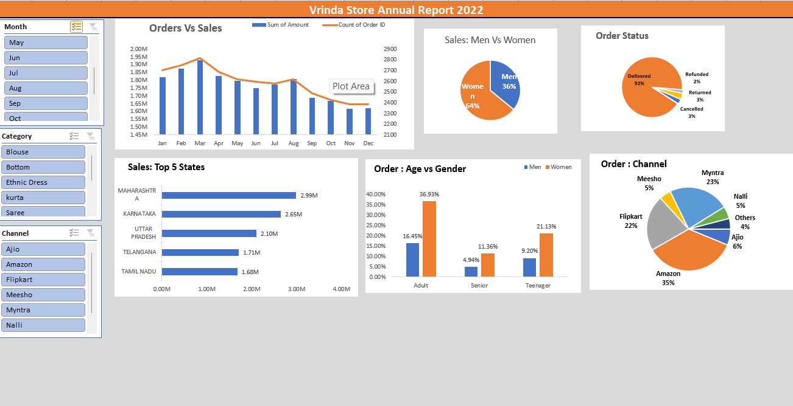

# Vrinda Store Annual Sales Report 2022

## Problem
Analyse 2022 sales data of Vrinda Store to understand sales trends, customer demographics and order performance.

## Tools Used
Excel: Data Cleaning, Pivot Tables, Pivot Charts, Slicers

## What I Did
- Cleaned the data and checked for duplicate records
- Built Pivot Tables and Pivot Charts for Orders vs Sales, Top 5 States, Men vs Women, Order Status, Age vs Gender and Channel
- Added slicers (Month, Category, Channel) to make the dashboard interactive

## Key Insights
- Women customers contributed about 64% of sales, men about 36%
- About 92% of orders were delivered; 3% cancelled and 3% returned
- Maharashtra is the top state by sales (2.99M), followed by Karnataka (2.65M) and Uttar Pradesh (2.10M)
- Amazon is the biggest sales channel (35%), followed by Myntra (23%) and Flipkart (22%)
- Sales peaked in March and declined gradually towards the end of the year
- Adult women are the largest customer group (36.93% of orders)

## Dashboard

